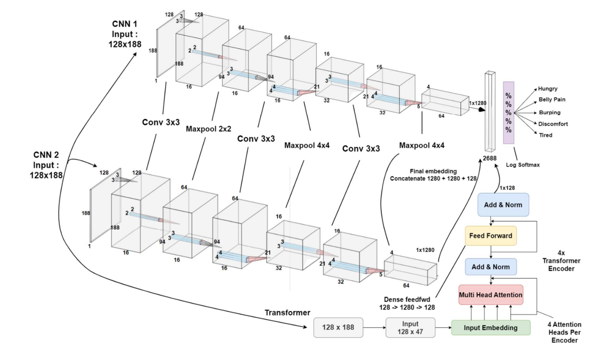

## Infant Cry Classifier using Transformer
### [See Notebook for Code and Explanations]

|  80.44% Accuracy     |       |
|---------------------------|------------------|
  | |

# Abstract
Infant crying noises analysis is essential for understanding and addressing the needs of babies. This research focuses on comparing the performance of a Convolutional Neural Network (CNN) model and a Transformer model for categorizing infant cries into five reasons: hunger, pain, burping needs, discomfort, and tiredness. The models are evaluated on a labeled dataset comprising 457 cry audio files obtained from the Donate a Cry corpus. Mel-frequency cepstral coefficients (MFCC) are used as features to capture the frequency content of the crying sounds. The Transformer model is developed and compared against the CNN model for classification accuracy. Different augmentation levels are applied to both models for evaluation. The results indicate that the Transformer model exhibits higher accuracy compared to the CNN model across multiple augmentation levels. The highest accuracy is achieved by the Transformer model with 4 augmentations. These findings demonstrate the effectiveness of the Transformer model for accurately categorizing infant cries based on their underlying reasons. This research contributes to the field of infant cry analysis by highlighting the advantages of utilizing the Transformer model over the traditional CNN model. 
